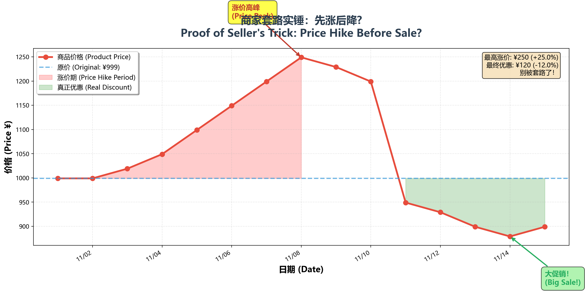
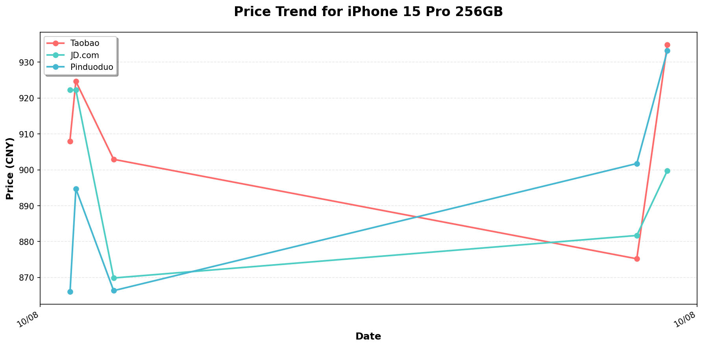

# 🏷️ PriceDive - 电商价格追踪神器

<div align="center">



**别让"促销"套路骗了你！PriceDive 帮你揭穿电商的价格套路**

[](https://www.python.org/downloads/)
[](LICENSE)
[]()
[](https://github.com/psf/black)

[🇨🇳 中文](#-中文文档) | [🇺🇸 English](#-english-documentation) | [📖 详细教程](docs/USAGE.md) | [🚀 快速开始](#-快速开始)

</div>

---

## 📑 目录 | Table of Contents

### 🇨🇳 [中文文档](#-中文文档)
- [项目简介](#-项目简介)
- [为什么选择 PriceDive](#-为什么选择-pricedive)
- [核心功能](#-核心功能)
- [快速开始](#-快速开始)
- [功能演示](#-功能演示)
- [详细文档](#-详细文档)
- [技术栈](#-技术栈)

### 🇺🇸 [English Document](#-english-documentation)
- [Introduction](#-introduction)
- [Why PriceDive](#-why-pricedive)
- [Key Features](#-key-features)
- [Quick Start](#-quick-start)
- [Demo](#-demo)
- [Documentation](#-documentation)
- [Tech Stack](#-tech-stack)

---

<a name="中文文档"></a>
# 🇨🇳 中文文档

[Switch to English 🇺🇸](#-english-documentation)

## 🎯 项目简介

**PriceDive** 是一个基于 Python 的智能电商价格追踪系统，专为应对"618"、"双11"等购物节设计。它能自动监控同一商品在淘宝、京东、拼多多等多个平台的价格变化，生成精美的价格趋势图表，计算价格涨跌幅度，并自动发送到 Twitter 分享给更多人。

**一图看穿商家套路！** 📊

## 💡 为什么选择 PriceDive？

### 🔍 揭露价格套路
你是否遇到过这样的情况？
- ❌ "满减优惠"前商品偷偷涨价
- ❌ "双11特价"比平时还贵
- ❌ "限时折扣"其实是原价销售

**PriceDive 让价格操纵无所遁形！**

### 📈 真实案例
```
Day 1:  ¥999  ─ 正常价格
Day 5:  ¥1,199 ─ 悄悄涨价 📈 +20%
Day 10: ¥899  ─ "大促销！" 实际优惠 -10%
```
表面打折 25%，实际只便宜了 10%！

### ✨ 核心优势
- ✅ **全自动监控** - 每天自动抓取，无需人工
- ✅ **多平台对比** - 同时追踪 N 个平台，找到真低价
- ✅ **可视化图表** - 一图看懂价格趋势
- ✅ **社交分享** - 一键发推，帮助更多人
- ✅ **完全免费** - 开源项目，永久免费

## 🚀 核心功能

### 1️⃣ 智能价格追踪
```python
✓ 支持淘宝、京东、拼多多等主流电商
✓ 每日自动抓取价格数据
✓ 本地 SQLite 数据库存储
✓ 完整的历史价格记录
```

### 2️⃣ 精美数据可视化
```python
✓ 多平台价格对比曲线图
✓ 专业的 matplotlib 图表
✓ 清晰的日期标注
✓ 颜色区分不同平台
```

### 3️⃣ 智能价格分析
```python
✓ 自动计算日涨跌幅度
✓ 识别异常价格波动
✓ 生成价格变化报告
✓ 趋势预测（可扩展）
```

### 4️⃣ 社交媒体分享
```python
✓ 自动发布到 Twitter
✓ 图文并茂的价格报告
✓ 帮助更多消费者避坑
✓ 传播消费者权益意识
```

### 5️⃣ 开发者友好
```python
✓ 模块化代码设计
✓ 150+ 行详细注释
✓ 类型提示完整
✓ 易于扩展和定制
```

## 🎬 快速开始

### 📦 安装依赖（1 分钟）
```bash
# 克隆或下载项目
cd pricedive

# 安装所需包
pip install -r requirements.txt
```

### ⚙️ 配置文件（2 分钟）
编辑 `config.json`：

```json
{
  "product_name": "iPhone 15 Pro 256GB",
  "targets": [
    {
      "platform": "淘宝",
      "url": "https://item.taobao.com/item.htm?id=你的商品ID"
    },
    {
      "platform": "京东",
      "url": "https://item.jd.com/你的商品ID.html"
    },
    {
      "platform": "拼多多",
      "url": "https://mobile.yangkeduo.com/goods.html?goods_id=你的商品ID"
    }
  ],
  "twitter_api_keys": {
    "consumer_key": "你的密钥",
    "consumer_secret": "你的密钥",
    "access_token": "你的令牌",
    "access_token_secret": "你的令牌"
  }
}
```

### 🎯 运行程序（1 分钟）
```bash
# 方式一：直接运行
python pricedive.py

# 方式二：使用启动脚本
# Windows 用户
run_pricedive.bat

# Linux/Mac 用户
chmod +x run_pricedive.sh
./run_pricedive.sh
```

### 🎨 生成宣传图
```bash
python generate_hook_chart.py
```
生成 V 型价格曲线图，揭露商家套路！

## 📊 功能演示

### 价格趋势图示例
运行程序后会生成 `price_trend.png`：


### Twitter 推送示例
```
【PriceDive 每日播报】iPhone 15 Pro 256GB
淘宝: ¥8,899.00 (📉 -2.3%)
京东: ¥8,999.00 (📈 +1.5%)
拼多多: ¥8,799.00 (➡️ 无变化)

哪个平台在备战购物节？
#价格追踪 #618 #双11
```

### 数据库记录
所有数据保存在 `prices.db`：
```sql
sqlite> SELECT * FROM prices ORDER BY timestamp DESC LIMIT 3;

id | timestamp           | product_name        | platform | price
---|---------------------|---------------------|----------|-------
1  | 2025-10-08 10:00:00 | iPhone 15 Pro 256GB | 淘宝     | 8899.00
2  | 2025-10-08 10:00:05 | iPhone 15 Pro 256GB | 京东     | 8999.00
3  | 2025-10-08 10:00:10 | iPhone 15 Pro 256GB | 拼多多   | 8799.00
```

## 📖 详细文档

| 文档 | 说明 |
|------|------|
| **[START_HERE.md](docs/START_HERE.md)** ⭐ | 新手必读！5分钟上手指南 |
| **[QUICK_REFERENCE.md](docs/QUICK_REFERENCE.md)** | 常用命令速查表 |
| **[USAGE.md](docs/USAGE.md)** | 完整使用教程（包含爬虫实现） |
| **[PROJECT_SUMMARY.md](docs/PROJECT_SUMMARY.md)** | 技术架构文档 |

## 🛠 技术栈

- **语言**: Python 3.8+
- **HTTP 请求**: httpx (现代、异步友好)
- **数据存储**: SQLite3 (轻量级数据库)
- **数据可视化**: matplotlib (专业图表库)
- **Twitter API**: tweepy (官方推荐)
- **任务调度**: cron / Windows 任务计划程序

## 📅 自动化运行

### Windows 任务计划程序
1. 打开"任务计划程序"
2. 创建基本任务
3. 设置每天 10:00 运行
4. 程序：`python.exe`
5. 参数：`C:\path\to\pricedive.py`

### Linux/Mac Cron
```bash
crontab -e
# 每天上午 10:00 运行
0 10 * * * cd /path/to/pricedive && python3 pricedive.py
```

## 🔐 重要提示

### ⚠️ 爬虫功能说明
默认版本使用**模拟价格**进行测试。要追踪真实价格，需要：
1. 检查目标网站的 HTML 结构
2. 找到价格元素的 CSS 选择器
3. 实现解析逻辑（详见 [USAGE.md](USAGE.md)）
4. 添加反爬虫措施（请求头、延迟等）

### 🐦 Twitter API 设置
1. 前往 [Twitter 开发者平台](https://developer.twitter.com/)
2. 创建开发者账号
3. 生成 API 密钥
4. 添加到 `config.json`
5. 确保应用有"读写"权限

**注意**：没有 Twitter API 也能正常使用！程序会自动跳过发推步骤。

### ⚖️ 法律声明
本项目**仅供学习和个人使用**。在使用网络爬虫时：
- 遵守目标网站的服务条款
- 尊重 robots.txt 规则
- 添加请求延迟，避免过载服务器
- 优先使用官方 API
- 了解当地法律法规

## 🤝 贡献指南

欢迎提交 Issue 和 Pull Request！

- 🐛 发现 Bug？请提交 Issue
- 💡 有新想法？欢迎讨论
- 🔧 改进代码？提交 PR

## 📄 开源协议

[MIT License](LICENSE) - 自由使用、修改和分发

## 🌟 支持项目

如果这个项目对你有帮助：
- ⭐ 给项目点个 Star
- 🐦 分享到社交媒体
- 📣 告诉朋友们
- 💖 帮助更多消费者避坑

## 📞 联系方式

- 📧 Email: xdhuang@dail.email
- 💬 讨论: GitHub Issues
---

<div align="center">

**用数据说话，用价格监督，让消费更透明！**

Made with ❤️ for Smart Shoppers

</div>

---

<a name="english-documentation"></a>
# 🇺🇸 English Documentation

[切换到中文 🇨🇳](#-中文文档)

## 🎯 Introduction

**PriceDive** is an intelligent e-commerce price tracking system built with Python, designed specifically for major shopping festivals like "618" and "Double 11". It automatically monitors product prices across multiple platforms (Taobao, JD.com, Pinduoduo), generates beautiful price trend charts, calculates price changes, and shares findings on Twitter.

**Expose price manipulation with data! 📊**

## 💡 Why PriceDive?

### 🔍 Expose Price Tricks
Have you ever experienced:
- ❌ Prices raised before "Big Sale" events
- ❌ "Special Discount" more expensive than usual
- ❌ "Limited Time Offer" at regular price

**PriceDive makes price manipulation visible!**

### 📈 Real Example
```
Day 1:  $999  ─ Normal price
Day 5:  $1,199 ─ Silently increased 📈 +20%
Day 10: $899  ─ "HUGE SALE!" Actually -10%
```
Advertised 25% off, actually only 10% cheaper!

### ✨ Key Advantages
- ✅ **Fully Automated** - Daily auto-scraping, hands-free
- ✅ **Multi-Platform** - Track multiple platforms simultaneously
- ✅ **Visual Charts** - Understand trends at a glance
- ✅ **Social Sharing** - Tweet with one click
- ✅ **100% Free** - Open source, forever free

## 🚀 Key Features

### 1️⃣ Intelligent Price Tracking
```python
✓ Support major e-commerce platforms
✓ Automatic daily price scraping
✓ Local SQLite database storage
✓ Complete price history records
```

### 2️⃣ Beautiful Data Visualization
```python
✓ Multi-platform price comparison charts
✓ Professional matplotlib graphs
✓ Clear date annotations
✓ Color-coded platforms
```

### 3️⃣ Smart Price Analysis
```python
✓ Auto-calculate daily price changes
✓ Identify abnormal price fluctuations
✓ Generate price change reports
✓ Trend prediction (extensible)
```

### 4️⃣ Social Media Sharing
```python
✓ Auto-post to Twitter
✓ Reports with charts and text
✓ Help more consumers avoid scams
✓ Spread consumer awareness
```

### 5️⃣ Developer Friendly
```python
✓ Modular code design
✓ 150+ lines of detailed comments
✓ Complete type hints
✓ Easy to extend and customize
```

## 🎬 Quick Start

### 📦 Install Dependencies (1 minute)
```bash
# Clone or download the project
cd pricedive

# Install required packages
pip install -r requirements.txt
```

### ⚙️ Configuration (2 minutes)
Edit `config.json`:

```json
{
  "product_name": "iPhone 15 Pro 256GB",
  "targets": [
    {
      "platform": "Platform A",
      "url": "https://example.com/product_a"
    },
    {
      "platform": "Platform B",
      "url": "https://example.com/product_b"
    },
    {
      "platform": "Platform C",
      "url": "https://example.com/product_c"
    }
  ],
  "twitter_api_keys": {
    "consumer_key": "YOUR_KEY",
    "consumer_secret": "YOUR_SECRET",
    "access_token": "YOUR_TOKEN",
    "access_token_secret": "YOUR_SECRET"
  }
}
```

### 🎯 Run the App (1 minute)
```bash
# Method 1: Direct run
python pricedive.py

# Method 2: Use launcher scripts
# Windows users
run_pricedive.bat

# Linux/Mac users
chmod +x run_pricedive.sh
./run_pricedive.sh
```

### 🎨 Generate Hook Chart
```bash
python generate_hook_chart.py
```
Creates a V-shaped price curve chart exposing seller tricks!

## 📊 Demo

### Price Trend Chart Example
After running, `price_trend.png` is generated:


### Twitter Post Example
```
【PriceDive Daily Report】iPhone 15 Pro 256GB
Platform A: $899.00 (📉 -2.3%)
Platform B: $999.00 (📈 +1.5%)
Platform C: $879.00 (➡️ No change)

Which platform is ready for the shopping festival?
#PriceWatch #618 #Double11
```

### Database Records
All data saved in `prices.db`:
```sql
sqlite> SELECT * FROM prices ORDER BY timestamp DESC LIMIT 3;

id | timestamp           | product_name        | platform   | price
---|---------------------|---------------------|------------|-------
1  | 2025-10-08 10:00:00 | iPhone 15 Pro 256GB | Platform A | 899.00
2  | 2025-10-08 10:00:05 | iPhone 15 Pro 256GB | Platform B | 999.00
3  | 2025-10-08 10:00:10 | iPhone 15 Pro 256GB | Platform C | 879.00
```

## 📖 Documentation

| Document | Description |
|----------|-------------|
| **[START_HERE.md](docs/START_HERE.md)** ⭐ | Must-read! 5-minute quick start |
| **[QUICK_REFERENCE.md](docs/QUICK_REFERENCE.md)** | Command cheat sheet |
| **[USAGE.md](docs/USAGE.md)** | Complete guide (includes scraper implementation) |
| **[PROJECT_SUMMARY.md](docs/PROJECT_SUMMARY.md)** | Technical architecture docs |

## 🛠 Tech Stack

- **Language**: Python 3.8+
- **HTTP Requests**: httpx (modern, async-friendly)
- **Data Storage**: SQLite3 (lightweight database)
- **Data Visualization**: matplotlib (professional charts)
- **Twitter API**: tweepy (officially recommended)
- **Task Scheduling**: cron / Windows Task Scheduler

## 📅 Automation

### Windows Task Scheduler
1. Open "Task Scheduler"
2. Create Basic Task
3. Set trigger: Daily 10:00 AM
4. Program: `python.exe`
5. Arguments: `C:\path\to\pricedive.py`

### Linux/Mac Cron
```bash
crontab -e
# Run daily at 10:00 AM
0 10 * * * cd /path/to/pricedive && python3 pricedive.py
```

## 🔐 Important Notes

### ⚠️ Web Scraping Notice
The default version uses **simulated prices** for testing. To track real prices:
1. Inspect target website HTML structure
2. Find CSS selectors for price elements
3. Implement parsing logic (see [USAGE.md](USAGE.md))
4. Add anti-scraping measures (headers, delays, etc.)

### 🐦 Twitter API Setup
1. Go to [Twitter Developer Portal](https://developer.twitter.com/)
2. Create developer account
3. Generate API keys
4. Add to `config.json`
5. Ensure app has "Read and Write" permissions

**Note**: Works fine without Twitter API! The app will skip posting.

### ⚖️ Legal Disclaimer
This project is for **educational and personal use only**. When web scraping:
- Comply with website Terms of Service
- Respect robots.txt rules
- Add request delays to avoid overloading servers
- Use official APIs when available
- Understand local laws and regulations

## 🤝 Contributing

Issues and Pull Requests are welcome!

- 🐛 Found a bug? Submit an Issue
- 💡 Have ideas? Let's discuss
- 🔧 Code improvements? Submit a PR

## 📄 License

[MIT License](LICENSE) - Free to use, modify, and distribute

## 🌟 Support the Project

If this project helps you:
- ⭐ Star the project
- 🐦 Share on social media
- 📣 Tell your friends
- 💖 Help more consumers avoid scams

## 📞 Contact

- 📧 Email: xdhuang@dail.email
- 💬 Discussions: GitHub Issues

---

<div align="center">

**Let data speak, monitor prices, make shopping transparent!**

Made with ❤️ for Smart Shoppers

[⬆ Back to Top](#-pricedive---电商价格追踪神器)

</div>
